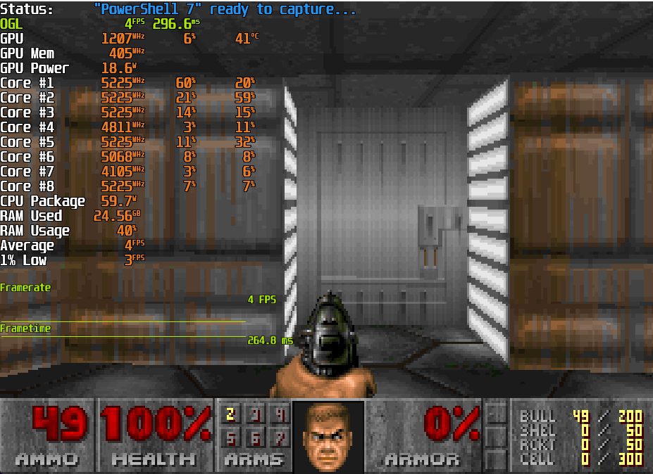

# ManagedDoomPowershell
A port of Managed Doom to Powershell, hence the name "Managed Doom Powershell" to highlight it comes from Managed Doom.
I stand on their shoulders.

* Most features seems to work.
Wipeffect after level finish bug.
No framecap implemented, only applicable on boot and level endings where former is to our advantage.


Performance is poor as expected, below is a screenshot from Windows 11 running without Realtime Protection.
Linux is considerably faster but still slow, this is due to Anti Malware Scan Interface on Windows powershell build (AMSI)



Video of it running on Linux:

[](https://www.youtube.com/watch?v=yJiiTx4C87o)
## 

## Windows Installation.
Ensure you have pwsh.exe (powershell.exe and pwsh.exe are two different things).

This is written for powershell 7+ and only tested with 7.5.4 and 7.6

Download the project, Unzip.
Place a .wad file into /src folder.

*Recommended that you Either disable realtime protection in windows defender, this is purely for performance.
Understand implications of disabling it, and if you do strongly consider re-enabling it afterwards.

Provisions are in place for ARM64 windows, but it is untested.

Navigate to src folder and run startgame_windows.cmd

Alternatively 
in a terminal
pwsh c:/pathto/manageddoompowershell/src/PowershellHandler/StartGame.ps1

To where your folder is, immediate subfolders should be /src and /External
And run selection of StartGame.ps1

## Linux Installation.

Download the project, Unzip.

Ensure you have Powershell installed, 7.5.4 and 7.6 are tested

This requires glfw installed

Fedora
```sudo dnf install glfw```
Ubuntu 
```sudo apt-get install glfw```

in a terminal
pwsh /path/to/manageddoompowershell/src/PowershellHandler/StartGame.ps1

## MacOS
Tested on M1 Max, provisions should be present to run on x86_64 macos, but it is untested.

Tested with Powershell 7.5.4 and 7.6

With brew you can install both powershell and glfw which is required, it also needs to build .net with sdk.
Due to GLFW and macos cocoa limitation where main thread has to have the window.

```brew install powershell```
```brew install glfw```
```brew install --cask dotnet-sdk```
in a terminal

pwsh /path/to/manageddoompowershell/src/PowershellHandler/StartGame.ps1


## License

Managed Doom Powershell is distributed under the [GPLv2 license](licenses/LICENSE_ManagedDoomPwsh.txt).  
Managed Doom Powershell uses the following libraries:

* [Silk.NET](https://github.com/dotnet/Silk.NET) by the the Silk.NET team ([MIT License](licenses/LICENSE_SilkNET.txt))
* [TrippyGL](https://github.com/SilkCommunity/TrippyGL) by Thomas Mizrahi ([MIT License](licenses/LICENSE_TrippyGL.txt))
* [TimGM6mb](https://musescore.org/en/handbook/soundfonts-and-sfz-files#gm_soundfonts) by Tim Brechbill ([GPLv2 license](licenses/LICENSE_TimGM6mb.txt))
* [DrippyAL](https://github.com/sinshu/DrippyAL) ([MIT License](licenses/LICENSE_DrippyAL.txt))
* [MeltySynth](https://github.com/sinshu/meltysynth/) ([MIT license](licenses/LICENSE_MeltySynth.txt))

Silk.NET uses the following native libraries:

* [GLFW](https://www.glfw.org/) ([zlib/libpng license](licenses/LICENSE_GLFW.txt))
* [OpenAL Soft](https://openal-soft.org/) ([LGPL license](licenses/LICENSE_OpenALSoft.txt))

## References


* [Managed-Doom](https://github.com/sinshu/managed-doom)
